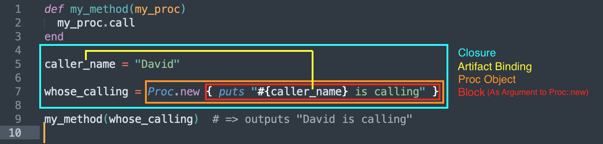

# Closures in Ruby
## Section Links

[What Is A Closure](#what-is-a-closure)\
[Blocks, Procs and Lambda](#blocks-procs-and-lambda)\
[Calling Methods With Blocks](#calling-methods-with-blocks)\
[Explicit Block Parameter](#explicit-block-parameter)\
[Argument To Block Conversion](#argument-to-block-conversion)\
[When To Design Methods That Use Blocks](#when-to-design-methods-that-use-blocks)


---

## What Is A Closure
A **closure** is an abstract programming concept that exists across multiple languages. It refers to a "chunk of code" that can be saved for execution at a later time, likely from a different location. Closures work by **binding** surrounding artifacts, which can be variables, constants or methods, that are referenced within the code chunk.

This **binding** creates an _virtual enclosure_ (the reason why this construct is called a closure) around the artifacts, allowing them to be referenced and/or updated when the closure is subsequently executed, _even in a code location where these variables are not-in-scope._


### \[Refresher\] Blocks and Variable Scope
A block creates a new scope for local variables. Only outer local variables are accessible to inner blocks.
```ruby
level_1 = "outer-most variable"

[1, 2, 3].each do |n|                     # block creates a new scope
  level_2 = "inner variable"

  ['a', 'b', 'c'].each do |n2|            # nested block creates a nested scope
    level_3 = "inner-most variable"

    # all three level_X variables are accessible here
  end

  # level_1 is accessible here
  # level_2 is accessible here
  # level_3 is not accessible here

end

# level_1 is accessible here
# level_2 is not accessible here
# level_3 is not accessible here
```

### Closure and Binding
A closure **tracks its bindings continually** to have up-to-date information available during execution. Whenever it is executed, it will drag all of it around. Hence any changes in artifacts' values after closure definition will be reflected when the closure is executed.
```ruby
def call_me(some_code)
  some_code.call
end

name = "Robert"
chunk_of_code = Proc.new {puts "hi #{name}"}
name = "Griffin III"        # re-assign name after Proc initialization

call_me(chunk_of_code)
```

The output is:
```none
hi Griffin III
=> nil
```
In above example, even though `name` was reassigned to a new value after the `Proc` object `chunk_of_code` was created, the `Proc` object was still able to output the updated value on execution. This suggest that the **binding is not static**: just storing the values of artifacts at `Proc` object creation. Instead, the binding allows the `Proc` object to **dynamically reference** and retrieve the up-to-date values at point of invocation.

### Out of Scope Binding
Artifacts that are **not in scope** during closure definition is not part of the binding and will raise a `NameError`, not during closure definition, but when the closure is executed.
```ruby
def call_chunk(code_chunk)
  code_chunk.call
end

say_color = Proc.new { puts "The color is #{color}" }
color = "blue"
call_chunk(say_color)
```
In the code snippet above, local variable `color` isn't part of the `Proc` object's binding since it isn't in scope when the `Proc` object is instantiated. This will raise an error when we try to call the `code_chunk` closure within the `call_chunk` method, and not during the closure definition. This can be fixed by placing `color = "blue"` above the closure definition to make it in-scope.

### Creating Closures in Ruby
In Ruby, we can create closures in 3 ways:
- **Blocks**,
- **Proc** objects, and 
- **lambda** objects

### Using Closures
As methods and blocks can return `Proc` or `lambda` objects (note: a block cannot be a return value), that make closures very useful.

**Example: Proc as Return Value**
```ruby
def sequence
  counter = 0
  Proc.new { counter += 1 }
end

s1 = sequence
p s1.call           # => 1
p s1.call           # => 2
p s1.call           # => 3
puts

s2 = sequence
p s2.call           # => 1
p s1.call           # => 4 (note: this is s1)
p s2.call           # => 2
```
- `#sequence` method returns a `Proc` object that forms a closure with local variable `counter`.
- Each time we call the `Proc` object, it increments it own **private copy** of `counter`, returning `1`, `2`, `3` etc on each subsequent call.
- Every call to `sequence` returns a new `Proc` object, each with its **own copy** of `counter`. Hence the counter values of `s1` and `s2` are independent 

[Back to Top](#section-links)


## Blocks, Procs and Lambda
### Blocks
Blocks are an unnamed chunks of code enclosed by `{ ... }` or `do ... end`. Unlike `Proc` or `Lambda`, they are **not objects** and cannot be the return value of methods or other blocks.
```ruby
[1, 2, 3].each { |num| puts num }  # single line block

[1, 2, 3].map do |num|             # multi-line block 
  puts "Squaring #{num}"
  num * num
end
```

They can be passed in to a method implicitly or explicitly when defined in the method parameter.
```ruby
def implicit_block
  puts "In implicit block method"
  yield if block_given?
end

def explicit_block(&block)
  puts "In explicit block method"
  block.call
end

block_method { puts "Executing block" }
block_method2 { puts "Executing block" }
```

### Procs
A `Proc` object is an encapsulation of a block of code which can be 
- stored in a local variable
- passed to a method or another `Proc`
- called

There are several methods to create a `Proc`
1. Using the `Proc` class constructor
```ruby
proc1 = Proc.new {|x| x**2 }
proc1 # => #<Proc:0x00007ff2f38a1e00 (irb):68>
```

2. Using the `Kernel#proc` method as a shorthand for `Proc.new`
```ruby
proc2 = proc {|x| x**2 }
proc2 # => #<Proc:0x00007ff2f38a0aa0 (irb):70>
```

3. Converting a block into proc argument using `&`
```ruby
def make_proc(&block)
  block   # proc as return value
end

proc3 = make_proc {|x| x**2 }
proc3 # => #<Proc:0x00007ff2f3883f90 (irb):75>
```

There are also a few ways to call a Proc:
```ruby
proc1 = Proc.new {|x| x**2 }

proc1.call(3)  # => 9
# shorthands:
proc1.(3)      # => 9
proc1[3]       # => 9
```

### Lambdas
A `Lambda` is a type of `Proc` object.
```Ruby
my_lambda = lambda { |thing| puts "This is a #{thing}." }
puts my_lambda         # output: #<Proc:0x00007faec68c6fa0 (irb):22 (lambda)>
puts my_lambda.class   # output: Proc
```

However, it differs from a regular `Proc` in terms of 
- [arity](#arity) and
- behavior with control flow keywords such as `return`, `raise`, `break`, `redo` and `retry` etc. 
```ruby
def call_proc
  puts "before proc"
  my_proc = Proc.new do
    puts "inside proc"
    return
  end
  my_proc.call
  puts "after proc"
end

call_proc
# before proc
# inside proc


def call_lambda
  puts "before proc"
  my_proc = lambda do
    puts "inside proc"
    return
  end
  my_proc.call
  puts "after proc"
end

call_lambda
# before proc
# inside proc
# after proc
```
In the example above, the final `puts` in the method `call_proc` was never executed as the `return` statement in the proc dumps us out of both the proc as well as the enclosing method. In `call_lambda` however, the `return` from the lambda only dumps us out of the lambda itself and the enclosing method continues executing. This difference in the way how control flow keywords behave in procs and lambdas is one of the main difference between them. 

Lambdas can be created in 2 ways:
- Using `Kernel#lambda`
```ruby
lambda1 = lambda {|x| x**2 }
lambda1 # => #<Proc:0x00007ff2f3912560 (irb):78 (lambda)>
```
- Using the Lambda `Proc` literal `->`
```ruby
lambda2 = ->(x) { x**2 }
lambda2 # => #<Proc:0x00007ff2f38c0fa8 (irb):80 (lambda)>
```

**Note**: 
Lambdas have a different signature compared to regular `proc` objects when printed with `puts`: they have an extra `(lambda)` at the end. Also, since `Lambda` is not a class, they do not have a constructor and thus cannot be created using `Lambda.new { ... }`

[Back to Top](#section-links)


## Calling Methods With Blocks
Every method call in Ruby **can accept** an implicit block. Depending on how the method is implemented, it may or may not make use of the block in the method body. Even if the block is not utilised, passing in a block will not result in an error.
```ruby
# Method doesn't use the block
def echo(str)
  puts str
end

echo("hello") { puts "world" } # outputs "hello"

# Method uses the block
def echo2(str)
  puts str + yield
end

echo2("hello") { " world" }    # outputs "hello world"
```

Even when a method uses a block, how it uses the block return value(s) also varies and depends on its implementation. Examples include:
- `Integer#times` executes the block but **ignores all block return values**, ultimately returning the caller at the end of the method call.
- `Array#map` executes the block and **uses all block return values as elements of a new array** to be returned by the method.
- `Hash#select` executes the block and **uses the truthiness of block return values to select** key-value pairs to include in a **new hash** to be returned by the method.
```ruby
# Example 1: passing in a block to the `Integer#times` method.

3.times do |num|
  puts num
end
=> 3

# Example 2: passing in a block to the `Array#map` method.

[1, 2, 3].map do |num|
  num + 1
end
=> [2, 3, 4]

# Example 3: passing in a block to the `Hash#select` method.

{ a: 1, b: 2, c: 3, d: 4, e: 5 }.select do |_, value|
  value > 2
end
=> { c: 3, d: 4, e: 5 }
```

[Back to Top](#section-links)


### Yielding
In a method body, execution will pass from the method to the block each time the Ruby interpreter encounters the `yield` keyword. After the block finishes execution and returns, execution resumes where it left off in the method body.

If we call a method containing one or more `yield` keyword without passing in a block, execution of the `yield` statement will result in a `LocalJumpError`.
```ruby
def echo_with_yield(str)
  puts str
  yield
end

echo_with_yield("hello!")                          # => LocalJumpError: no block given (yield)
```

To allow methods to be flexible enough to be invoked with or without a block, we can use `Kernel#block_given?` as a conditional guard for the `yield` keyword. Since this method only returns `true` when a block has been passed in, we will not run into the situation of yielding to an non-existent block. 
```ruby
def echo_with_yield(str)
  yield if block_given?
  str
end

echo_with_yield("hello!")                   # => "hello!"
echo_with_yield("hello!") { puts "world" }  # outputs "world" and returns "hello"             
```

[Back to Top](#section-links)


### Yielding With Argument
Like methods, blocks can be defined with parameters. In the example below, the block passed to `#times` has a single parameter `num`.
```ruby
3.times do |num|
  puts num
end
```

#### Arity
Arity refers to the **rule** specifying the **number of arguments** we need to pass to a `block`, `proc` or `lambda` in Ruby.

- Methods and `lambda` objects observe **strict arity**: the number of arguments passed in **need to match** what is expected, otherwise an **ArgumentError** will be raised.

- Blocks and `proc` objects observe **lenient arity**: **mismatches** between number of arguments and parameters defined **do not** generate an error.
	1. **Extra arguments** beyond what a block expects are **ignored**.
	```ruby
	# method implementation
	def test
	  yield(1, 2)                           # passing 2 block arguments at block invocation time
	end

	# method invocation
	test { |num| puts num }                 # outputs "1" and second argument is ignored
	```

	2. **Insufficent arguments** than what is expected just meant that parameters without a corresponding argument is assigned a value of **`nil`**
	```ruby
	# method implementation
	def test
	  yield(1)                              # passing 1 block argument at block invocation time
	end

	# method invocation
	test do |num1, num2|                    # expecting 2 parameters in block implementation
	  puts "#{num1} #{num2}"                # outputs "1 " since num2 is nil
	end
	```

#### Use of Splat Operator `*` in Argument Passing
_At argument sending end (i.e. method invocation or yielding to block)_: a splat operator (`*`) applied on an array argument will convert it into a list of `n` arguments.

_At argument receiving end (i.e. method or block definition)_: Splat operator will convert that parameter into a collection to receive a list of arguments i.e. match a variable number of arguments. 

The splat operator, while optional, but can be applied to a **parameter in any position** (start, middle or tail) in the parameter list of a method or block when required.

There is a difference when we pass array arguments in method calls vs yielding to block.
- **Method invocation**: It is mandatory to apply the  splat operator to the array argument to avoid an 	`ArgumentError` 
	```ruby
	def my_method(a, *b, c)
	  p a
	  p b
	  p c
	end

	my_method(*[1, 2, 3])  # => a = 1, b = [2], c = 3
	my_method(*[1, 2])     # => a = 1, b = [], c = 2
	my_method([1, 2, 3])   # => Argument error, given 1, expected 2+
	```

- **Yielding to block**: A splat operator is **optional**. Conversion from array to list of arguments happens **automatically** under the hood even when we omit the splat operator.
	```ruby
	def to_block(arr)
	  yield(arr)
	end

	to_block([1, 2, 3, 4]) do |a, *b, c|
	  p a
	  p b
	  p c
	end
	# argument assignment: a = 1, b = [2, 3], c = 4

	def to_block(arr)
	  yield(*arr)
	end

	to_block([1, 2, 3, 4]) do |a, *b, c|
	  p a
	  p b
	  p c
	end
	# argument assignment: a = 1, b = [2, 3], c = 4
	```
	[Link to pass parameter example](../../../04_rb130_more_topics/03_exercises/04_medium_1/05_pass_parameter_3.rb)

[Back to Top](#section-links)


### Block Return Values
```ruby
def compare(str)
  puts "Before: #{str}"
  after = yield(str)
  puts "After: #{after}"
end

# method invocation
compare('hello') { |word| word.upcase }
```

Output from method invocation:
```plaintext
Before: hello
After: HELLO
=> nil
```
Like methods, the evaluated value of the last executed statement in a block will be returned by the block. It is up to the method to determine how this value will be used. In above example, the return value is assigned to `after` for subsequent output.

[Back to Top](#section-links)


## Explicit Block Parameter
All methods in Ruby can take an implicit block. An implicit block is one passed to a method call without being assigned to a parameter of that method. Because of this, an implicit block is essentially anonymous. The block cannot be saved for repeated use and the only way to execute the block content within the method is to hand execution to it via `yield` and pass along any arguments it may require. 

If we want more flexibility in using the block, we can pass it in explicitly. An **explicit block** is one that gets **assigned to a parameter** of the method being invoked. The `&` operator applied to this parameter helps convert the block into a `Proc` object, conferring it the following benefits over an implicit block:
 - giving it a name handle, 
 - allowing it to be passed around or referenced and
 - allowing it to be invoked whenever needed

**Defining And Using An Explicit Block**: 
- The parameter being assigned the block has to be the **last** parameter in the method definition and be prepended with the unary `&` operator. 
- The `&` operator will convert the incoming block to a `Proc` object and assigned it to the parameter
- This `Proc` object can now be referenced or passed to another method inside the method body via the parameter (without any `&` prepended).
- If we want to execute it, we can invoke the `Proc#call` method on the parameter.

Note: A method can only have **one** parameter with `&`.

**Example: Explicit Block to Proc** 
```ruby
def test(word, &block)
  puts "What's &block? #{block}"
  puts word
end

test("Nothing") { sleep(1) }

# What's &block? #<Proc:0x007f98e32b83c8@(irb):59>
# Nothing
# => nil
```
In above example, `{ sleep(1) }` is assigned to `block`. The `&` converts the block to a `Proc` object and is interpolated within the string using `to_s`, confirming it is a regular `Proc` object.

**Example: Passing Proc from Explicit Block Around** 
```ruby
def display(block)
  block.call(">>>") # Passing the prefix argument to the block
end

def test(&block)
  puts "1"
  display(block)
  puts "2"
end

test { |prefix| puts prefix + "xyz" }
# => 1
# => >>>xyz
# => 2
```
In above example, `{ |prefix| puts prefix + "xyz" }` is assigned to method parameter `block` in method `test` when `test` was invoked. `&` then converts `block` into a `Proc` object so that `block` is now referencing a `Proc` object within `test`. `block` is then passed into `display` as an argument (notice we do not need an `&` prefix for block in `display` since the argument passed in is already a `Proc` object). We then invoke this `Proc` using `call` and supply it with `">>>"` as argument.


[Back to Top](#section-links)

## Argument To Block Conversion
Earlier, we show how to convert a block to a `Proc` object by passing it as an explicit block to a method using the `&` operator. 

Sometimes, we might need to do the reverse, i.e. convert a `Proc` object back to a block because the method we are calling expects a block, not a `Proc`. 

**Example: Using `&` to Convert a Block to a Proc and then back to a Block**
```ruby
# true if any block return value is truthy
def any?(collection) 
  collection.each { |item| return true if yield(item) }  # expects a block
  false
end

# true only if any? returns false
def none?(collection, &my_block)
  !any?(collection, my_block)
end

none?([1, 3, 5, 6]) { |value| value.even? }  # => # ArgumentError (wrong number of arguments (given 2, expected 1))
```
While `#none?` is logically the negation of `#any?`, we cannot directly use the `#any?` code within `#none?` because `any?` expects a block, not a `Proc`. Doing so will result in an `ArgumentError` as `any?` was called with 2 arguments when it needs 1 argument and 1 block.

To convert a `Proc` object to a block, we prepend the unary `&` operator on an `Proc` object argument in the method call.

Solution:
```ruby
def any?(collection) 
  collection.each { |item| return true if yield(item) } 
  false
end

def none?(collection, &my_block)
  !any?(collection, &my_block)
end

none?([1, 3, 5, 6]) { |value| value.even? }  # => false
none?([1, 3, 5, 7]) { |value| value.even? }  # => true
```
- We invoke `none?` with an array and an explicit block. The array is assigned to `collection` while the block is converted to a `Proc` object by `&` and assigned to `my_block`.
- Since method `any?` expects a block (see the `yield` keyword), we prepend `my_block` with `&` which will convert the `Proc` back to its block form to be passed into `any?` in the method call.

### Symbol to Proc
We often also see `&` prepended to a `Symbol`. Since `Symbol` is not a `Proc` object, how does `&` convert it into its block equivalent?
```ruby
[1, 2, 3].map(&:to_s)           # => ["1", "2", "3"]

# is converted to the following equivalent block

[1, 2, 3].map { |n| n.to_s }    # => ["1", "2", "3"]
```

This is actually achieved in **two steps**:
- Ruby will first call [Symbol#to_proc](https://docs.ruby-lang.org/en/master/Symbol.html#method-i-to_proc) on the symbol prepended with `&` to convert it into a `Proc` object. 
- `&` can then convert the `Proc` to its block equivalent, then call the method with the generated block.
```ruby
# Step 1: Convert Symbol to Proc
to_s_proc = :to_s.to_proc
puts to_s_proc              # <Proc:0x00007fed5917b120(&:to_s)>

# Step 2: & convert proc to block
[1, 2, 3].map(&to_s_proc)   # (&to_s_proc) => { |n| n.to_s }
# => ["1", "2", "3"]
```

This shortcut works with **any collection method that takes a block**, not only on `map`
```ruby
["hello", "world"].each(&:upcase!)              # => ["HELLO", "WORLD"]
[1, 2, 3, 4, 5].select(&:odd?)                  # => [1, 3, 5]
[1, 2, 3, 4, 5].select(&:odd?).any?(&:even?)    # => false
```

**Symbol-to-proc** also works with any methods, including custom ones, as long as they don't have parameters
```ruby
def return_hi
  "hi"
end

[1, 2, 3].map(&:return_hi)
# => ["hi", "hi", "hi"]
```


Now that we understand the steps that occur under the hood, we can define a general syntax for converting an argument to block using `&` in a method call: 
```ruby
caller.method(&argument)
```
- Step 1: Attempt to convert argument to a `Proc` object if it is not already so.
- Step 2: `&` converts the `Proc` object to its equivalent block, then calls the method with the block. Alternatively, if step 1 failed to produce a `Proc` object, applying `&` on argument will raise a `TypeError`.
	```ruby
	class MyClass      #to_proc method not defined for MyClass
	end

	a = MyClass.new    
	[1, 2, 3].map(&a)
	# TypeError (wrong argument type MyClass (expected Proc))
	```

Note: argument can be **any object**, including a `Proc` or Symbol object. 

### Exceptions
Symbol-to-Proc shortcut can result in `NoMethodError` if the symbol does not correspond to a defined method
```ruby
a = :undefined_method.to_proc
# => <Proc:0x00007fbd0388eb28(&:undefined_method)>

# Step 2: & convert proc to block
[1, 2, 3].map(&a) 
# NoMethodError (undefined method `undefined_method' for 1:Integer)
```

Also, symbol-to-proc shortcut **doesnt work** with for methods with parameters
```ruby
# String#prepend(*other_strings) → string
["1", "2"].map { |n| n.prepend("The number is: ") }  # => ["The number is: 1", "The number is: 2"]

# shortcut doesn't work
["1", "2"].map(&:prepend("The number is: "))         # => syntax error, unexpected ')', expecting end-of-input ...ap(&:prepend "The number is: ")
```

Fortunately, `Method` objects offers a workaround for methods with parameters.
```ruby
def convert_to_base_8(n)
  n.to_s(8).to_i 
end

method_object = method(:convert_to_base_8)
puts method_object    # <Method: main.convert_to_base_8(n) (irb):189>

[8, 10, 12, 14, 16, 33].map(&method_object)
# => [10, 12, 14, 16, 20, 41]
```
- [Object#method(sym)](https://docs.ruby-lang.org/en/master/Object.html#method-i-method) takes a method name (without the parameters) in the form of a symbol and returns a `Method` object
- Ruby then converts `method_object` to a `Proc` object using [Method#to_proc](https://docs.ruby-lang.org/en/master/Method.html#method-i-to_proc)
- `&` then converts the `Proc` to a block that is equivalent to `{ |n| convert_to_base_8(n) }`. 
- This way, we have a indirect workaround for methods with parameters that cannot use the symbol-to-proc shortcut directly.

[Link to full example](../../../04_rb130_more_topics/03_exercises/04_medium_1/06_method_to_proc.rb)

[Back to Top](#section-links)


## When To Design Methods That Use Blocks
### Defer Implementation
In situations when the method developer is **not 100% certain how the method will be used** and want to **defer certain implementation details** to method users at usage time. 

### Sandwich Code
Sandwich code are methods that perform **certain common actions before and after their specific use case**. Examples include methods to time how long a code segment runs, opening and closing of files or database connections before and after usage.

**Example: Timer Methods**
```ruby
def time_it
  time_before = Time.now
  yield                       # execute the implicit block
  time_after= Time.now

  puts "It took #{time_after - time_before} seconds."
end

time_it { sleep(3) }                    # It took 3.003767 seconds.
                                        # => nil

time_it { "hello world" }               # It took 3.0e-06 seconds.
                                        # => nil
```

**Example: File Opening and Closing**\
When we use `File::open` to open a file, we have to **manually close** it to release system resources.
```ruby
my_file = File.open("some_file.txt", "w+")          # creates a file called "some_file.txt" with write/read permissions
# write to this file using my_file.write
my_file.close
```

Alternatively, `File::open` also have a **block accepting signature** that will **automatically close** the file after executing the block. This happens because the developer of `File::open` designed the method to open the required file, then pass the file handle to the block and close it after block returns, if a block is provided.
```ruby
File.open("some_file.txt", "w+") do |file|
  # write to this file using file.write
end
```

### General Rule
In general, if we observe repeated usage of a chunk of code but have to constantly introduce **minor tweaks at a common section** of this code chunk in order to meet the requirement of each use case, there could be an opportunity to develop a generic method that yields to a block. The **section where tweaks are introduced** to meet the requirements of the specific use case **are where the method yields to a block.** Sandwich code is actually an expression of this principle.

[Back to Top](#section-links)
